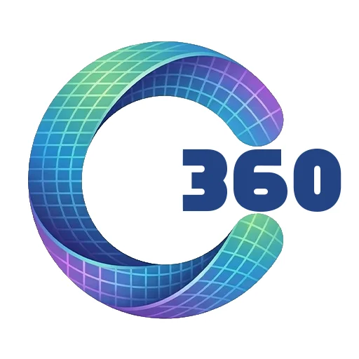

# 🔵 Caixa360

Fluxo de caixa inteligente para MEIs e pequenas empresas brasileiras.



## ✨ Funcionalidades

- 📊 **Dashboard completo** - Visão geral do seu negócio
- 💰 **Lançamentos** - Registre entradas e saídas
- 📦 **Fornecedores** - Gerencie seus fornecedores
- 💵 **Meu Salário** - Controle seu pró-labore
- 📅 **Contas a pagar/receber** - Nunca esqueça uma conta
- 📥 **Importar CSV/Excel** - Importe dados de planilhas
- 📄 **Relatórios** - Análise com IA
- 🎙️ **Lançamento por voz** - (em breve)
- 🔔 **Notificações** - Alertas de contas

## 🚀 Como rodar localmente

### Pré-requisitos

- Node.js 18+
- Conta no Supabase (gratuito)

### 1. Clone e instale

```bash
git clone <seu-repositorio>
cd caixa360
npm install
```

### 2. Configure o Supabase

1. Crie um projeto em [supabase.com](https://supabase.com)
2. Execute o script SQL em `supabase-schema.sql` no SQL Editor
3. Copie suas credenciais

### 3. Configure as variáveis de ambiente

Renomeie `.env.local.example` para `.env.local` e preencha:

```env
NEXT_PUBLIC_SUPABASE_URL=https://seu-projeto.supabase.co
NEXT_PUBLIC_SUPABASE_ANON_KEY=sua-anon-key
SUPABASE_SERVICE_ROLE_KEY=sua-service-role-key
```

### 4. Rode o projeto

```bash
npm run dev
```

Acesse: [http://localhost:3000](http://localhost:3000)

## 🔐 Configurar Login com Google (opcional)

1. Acesse [Google Cloud Console](https://console.cloud.google.com)
2. Crie um projeto e configure OAuth
3. Adicione a URL de callback: `https://seu-projeto.supabase.co/auth/v1/callback`
4. Cole o Client ID e Client Secret no Supabase > Authentication > Providers > Google

## 📁 Estrutura do projeto

```
caixa360/
├── app/                    # Páginas (Next.js App Router)
│   ├── page.tsx           # Login
│   ├── onboarding/        # Onboarding (3 perguntas)
│   ├── dashboard/         # Dashboard principal
│   ├── lancamentos/       # Lançamentos
│   ├── fornecedores/      # Fornecedores
│   ├── salario/           # Pró-labore
│   ├── contas/            # Contas a pagar/receber
│   ├── importar/          # Importar CSV
│   ├── relatorio/         # Relatórios
│   └── configuracoes/     # Configurações
├── components/
│   ├── ui/                # Componentes reutilizáveis
│   ├── layout/            # Layout com sidebar
│   └── charts/            # Gráficos
├── lib/
│   ├── supabase/          # Cliente Supabase
│   ├── types.ts           # Tipos TypeScript
│   └── utils.ts           # Funções utilitárias
├── public/
│   └── logo.png           # Logo
└── supabase-schema.sql    # Schema do banco de dados
```

## 🛠️ Tecnologias

- **Framework**: Next.js 14 (App Router)
- **Linguagem**: TypeScript
- **Estilo**: Tailwind CSS
- **Banco de dados**: Supabase (PostgreSQL)
- **Autenticação**: Supabase Auth
- **Gráficos**: Recharts
- **IA**: X.AI (Grok)
- **Ícones**: Lucide React

## 📱 Deploy

### Vercel (recomendado)

1. Conecte seu repositório GitHub
2. Configure as variáveis de ambiente
3. Deploy!

### Variáveis de ambiente para produção

```env
NEXT_PUBLIC_SUPABASE_URL=
NEXT_PUBLIC_SUPABASE_ANON_KEY=
SUPABASE_SERVICE_ROLE_KEY=
NEXT_PUBLIC_APP_URL=https://seu-dominio.com
```

## 🎯 Próximos passos

- [ ] Lançamento por voz
- [ ] Web Push notifications
- [ ] Resumo semanal automático
- [ ] WhatsApp integration
- [ ] App mobile (React Native)

## 📄 Licença

Proprietary - Todos os direitos reservados.

---

Feito com ❤️ para MEIs brasileiros
